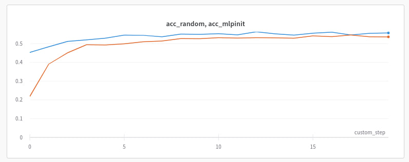

# Using Deep Graph Infomax (DGI) for MLPInit

The implementation is based on code provided by Snap Inc. under their own license:
Copyright Snap Inc. 2023. All rights reserved.
See Snap Inc.'s license for more details.

Source MLPInit code: https://github.com/snap-research/MLPInit-for-GNNs

Source MLPInit paper: https://arxiv.org/abs/2210.00102

Source DGI paper: https://arxiv.org/abs/1809.10341

## MLPInit
This discovery motivates the use of PeerMLP training as an initialization step to accelerate GNN training. MLPInit is a straightforward yet highly effective initialization method that enhances the speed and prediction performance of GNNs. Extensive experiments on various large-scale graph datasets with diverse GNN architectures demonstrate that MLPInit can accelerate GNN training (up to 33 times faster in some cases) and often improve prediction performance, making it a valuable tool for graph data tasks.

## DeepGraphInfomax
Deep Graph Infomax (DGI) is an unsupervised learning method designed for extracting meaningful node representations within graph-structured data. DGI accomplishes this by maximizing mutual information between patch representations (subgraph summaries) and high-level summaries of graphs. 

## Implementation details
In my project, I used DGI with the following feature masks:

a) we draw indexes from the range [0, dim) and for all vertices insert zeros into these positions

b) dropout, i.e., for each vertex we draw masking positions separately

## Results
In the version a) the model didn't converge.
In the version b) the results were not as good as expected:

The blue line represents the accuracy of the DGI model with randomly initialized weights, while the orange line corresponds to the accuracy of the model with weights pre-trained using the MLPInit method.

Thus, it turned out that the spaces of MLP and DGI are dissimilar to such an extent, that the preliminary weights obtained from MLPInit actually hinder the performance of the DGI model rather than improving it.